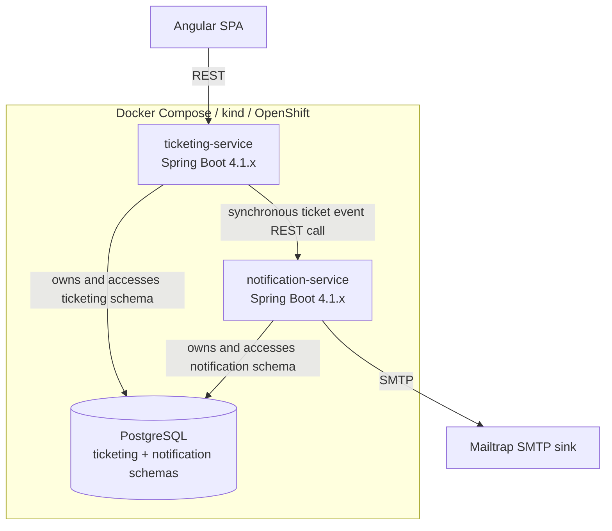
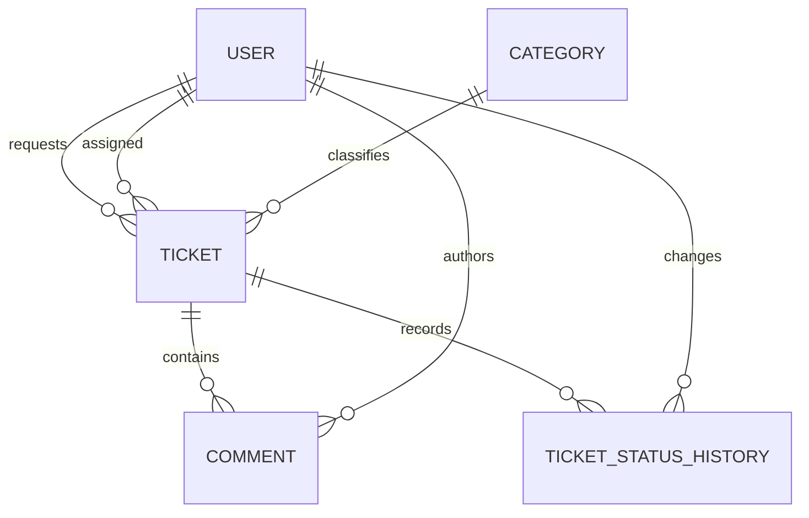
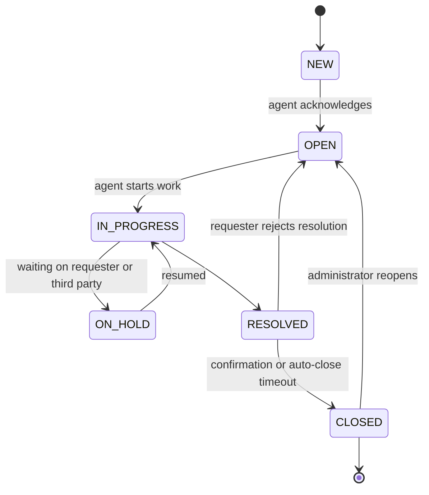

# Service Desk Architecture

## Status and scope

This document describes the intended MVP architecture for the IT service desk platform. It is derived from `tech-brief.md`; that brief remains the source of truth for domain scope and technology choices.

The system is intentionally small, but it is split into two independently deployable Spring Boot services so that local Kubernetes and OpenShift provide meaningful service discovery, configuration, secret management, and scaling exercises.

Some decisions are deliberately not made in the brief. They are listed in [Unresolved decisions](#unresolved-decisions) rather than being hidden behind assumed implementation details.

## System overview

The Angular application is the only presentation client in scope. It calls `ticketing-service` for application operations. It does not access PostgreSQL or `notification-service` directly.

`ticketing-service` is the system of record for ticketing data. `notification-service` reacts to ticket lifecycle events and is the system of record for notification delivery attempts. The services do not share tables or cross-schema foreign keys.

## Application layers and components

### Frontend: Angular SPA

The frontend is a separate Angular application and presentation layer. Its responsibilities are to:

- render requester and agent workflows;
- collect and validate user input appropriate for the UI;
- call the ticketing REST API;
- display ticket state, comments, assignments, and notification-relevant outcomes returned by the API.

The frontend does not contain authoritative business rules, persist data, call the database, or call the notification service. State changes must go through `ticketing-service`, where authorization, state transitions, SLA updates, and history writes are enforced.

### `ticketing-service`

This Spring Boot 4.1.x service is the core domain and application service. It owns:

- users and roles;
- categories;
- tickets and their SLA fields;
- comments;
- assignment of agents to tickets;
- ticket status transitions and status history;
- ticket lifecycle event creation;
- the scheduled polling process for SLA-breach warnings.

Its REST API is the boundary used by the Angular application. It validates commands, applies the ticket state machine, performs related writes transactionally where the brief requires it, and returns application results to the frontend.

For ticket lifecycle events, it calls `notification-service` synchronously over REST using the event payload defined in the brief. The exact failure, retry, and durability behavior for an unavailable notification service is not yet decided.

### `notification-service`

This Spring Boot 4.1.x service owns notification handling. It:

- accepts ticket lifecycle event requests from `ticketing-service`;
- determines the notification recipient and message details from the event;
- sends email through Mailtrap's SMTP endpoint;
- records each notification attempt in `NotificationLog`.

It has no direct access to ticketing tables and does not resolve ticket IDs by querying the ticketing schema. `ticketId` in its log is a plain reference supplied by the event.

### External and delivery components

- **PostgreSQL** is one database instance with a `ticketing` schema owned by `ticketing-service` and a `notification` schema owned by `notification-service`.
- **Mailtrap** is the development SMTP sink. It prevents MVP email testing from sending messages to real recipients.
- **Docker** supplies per-service images and local packaging.
- **GitHub Container Registry** stores the service images.
- **kind** is the local Kubernetes target for validating manifests.
- **OpenShift Developer Sandbox** is the deployment target. Deployments must be reproducible from committed Kubernetes or Helm configuration rather than console-only changes.
- **GitHub Actions** performs build and test, OWASP Dependency-Check, SonarQube Cloud analysis, and image build/push.

## Domain model

### Ticketing service model

`User` represents a requester, agent, or administrator. Email is unique. A user may request many tickets, be assigned to many tickets, author many comments, and make many status changes.

`Category` classifies tickets and contains a description and `defaultSlaHours`.

`Ticket` is the aggregate at the center of the ticketing domain. It contains:

- title, description, priority, and status;
- required requester and category references;
- an optional assignee reference;
- creation and update timestamps;
- `slaDueAt`;
- nullable `resolvedAt` and `closedAt`;
- `reopenCount`, maintained when a resolved or closed ticket is reopened;
- `firstResolvedAt`, set only on the first transition into `RESOLVED` and never overwritten.

`Comment` belongs to one ticket and records its author, body, internal/external visibility, and creation time.

`TicketStatusHistory` is the audit source of truth for every transition. It records the ticket, previous status, new status, actor, timestamp, and an optional note. A transition into `NEW` is represented with no previous status. Reopen transitions are recorded like every other transition.

The important relationships are:

### Ticket lifecycle

The allowed lifecycle from the brief is:

Every transition writes `TicketStatusHistory`. Transitions from `RESOLVED` or `CLOSED` to `OPEN` also increment `Ticket.reopenCount` in the same transaction. The first transition into `RESOLVED` sets `firstResolvedAt` once.

Priority supplies the documented SLA windows:

| Priority | SLA window |
|---|---:|
| `CRITICAL` | 4 hours |
| `HIGH` | 8 hours |
| `MEDIUM` | 24 hours |
| `LOW` | 72 hours |

The brief also gives `Category.defaultSlaHours`; the precedence between category and priority is unresolved and must be decided before SLA calculation is implemented.

### Notification model

`NotificationLog` belongs to `notification-service` and records the event type, plain ticket reference, recipient email, subject, send timestamp, `SENT` or `FAILED` status, and an optional error message. It is an operational record of notification delivery, not a copy of ticket data.

File attachments and per-user notification preferences are outside the MVP.

## Persistence architecture

PostgreSQL is deployed as a single instance for the local and target environments. Logical ownership is separated by schema:

| Schema | Owning service | Contents |
|---|---|---|
| `ticketing` | `ticketing-service` | Users, categories, tickets, comments, and status history |
| `notification` | `notification-service` | Notification logs |

Each service may read and write only its own schema. The `notification` schema contains no foreign key into `ticketing`; `NotificationLog.ticketId` is intentionally a plain reference to preserve the service boundary.

The domain model requires transactional consistency inside `ticketing-service` for a status transition, its history row, and the denormalized reopen/resolution fields. The brief does not yet define the durability or retry mechanism that should bridge a committed ticket transaction and a notification request.

Database schema changes must be versioned with the service and reproducible in local containers and Kubernetes/OpenShift deployments. The specific migration library is not selected in the brief and should not be assumed here.

## API and application boundaries

### Frontend to ticketing service

The Angular SPA communicates with `ticketing-service` through REST. The ticketing API is responsible for:

- user-facing ticket operations;
- category and user data needed by authorized workflows;
- comments and internal-comment visibility;
- assignment and status-transition commands;
- ticket history and SLA-related fields.

The frontend is never an authority for role checks, internal-comment visibility, allowed transitions, SLA calculation, or reopen accounting.

### Ticketing service to notification service

The current MVP boundary is synchronous REST. The event types are:

| Event | Trigger |
|---|---|
| `TICKET_CREATED` | A ticket is submitted |
| `TICKET_ASSIGNED` | An assignee is set or changed |
| `TICKET_STATUS_CHANGED` | Any status transition occurs |
| `SLA_BREACH_WARNING` | The ticketing service's scheduled SLA poll identifies a warning |

The event payload contains `eventType`, `ticketId`, `title`, `requesterEmail`, `assigneeEmail`, `oldStatus`, `newStatus`, `priority`, `slaDueAt`, and `timestamp`. Fields that do not apply to an event may be absent or null according to the eventual API contract.

The notification service should return an explicit success or failure response so the caller can observe delivery handling. Exact HTTP paths, status codes, timeouts, retry rules, and idempotency keys remain to be defined.

### Notification service to Mailtrap

Only `notification-service` integrates with SMTP. Mailtrap configuration is supplied as deployment configuration/secrets, not embedded in the ticketing domain or exposed to the frontend.

## Authentication and authorization

The domain model includes `REQUESTER`, `AGENT`, and `ADMIN` roles, but the brief does not select an authentication mechanism or identity lifecycle. The architecture therefore reserves authentication and authorization as a required cross-cutting concern without prescribing JWT, server sessions, an external identity provider, self-registration, or administrator provisioning.

Whichever mechanism is selected must enforce authorization in `ticketing-service`, including:

- requesters accessing only the tickets and comments permitted to them;
- agents performing triage, assignment, and resolution operations;
- administrators performing administrative operations such as the rare closed-ticket reopen.

Internal comments must be filtered by the backend according to the caller's authorization. Angular route guards may improve user experience but cannot replace backend enforcement.

The notification service receives recipient addresses as part of the event contract; it is not the owner of user identity or roles.

## Runtime and deployment topology

The same service boundaries are used in local and deployed environments:

1. Docker Compose provides a full local stack for development.
2. kind runs the committed Kubernetes manifests locally and validates service discovery, configuration, secrets, and image deployment.
3. OpenShift Developer Sandbox is the target deployment environment.

Each Spring Boot service is built as its own Docker image. Kubernetes/OpenShift configuration must keep service configuration and credentials outside the image through the appropriate ConfigMap/Secret mechanisms. PostgreSQL and Mailtrap connectivity are environment-specific configuration, while the service ownership rules remain the same.

The platform is intended to allow independent service scaling, but the scheduled SLA poll creates a scaling concern: the brief does not yet specify how to prevent duplicate polling when multiple `ticketing-service` replicas run.

## Testing strategy

Testing should follow the service boundaries and keep the project proportionate to its size.

### Unit tests

- Test ticket state transitions and reject invalid transitions.
- Test transactional domain rules for `reopenCount` and immutable `firstResolvedAt`.
- Test SLA calculation once the category/priority precedence is decided.
- Test notification event-to-email/log mapping without requiring SMTP.
- Test Angular components and services for form behavior and API interaction.

### Service integration tests

- Test `ticketing-service` REST endpoints with persistence against PostgreSQL-compatible test infrastructure.
- Verify that ticket creation and transitions persist the expected entities and history rows.
- Test `notification-service` event handling and `NotificationLog` outcomes.
- Test Mailtrap integration through a replaceable SMTP test configuration rather than sending real mail.

### Boundary and end-to-end tests

- Maintain focused contract tests for the frontend-to-ticketing REST API and the ticketing-to-notification event payload.
- Run a local-stack smoke test that creates a ticket through the public flow and verifies the corresponding notification log.
- Validate Kubernetes manifests and service-to-service discovery in kind before deploying to OpenShift.

GitHub Actions is expected to run build/test, OWASP Dependency-Check, SonarQube Cloud analysis, and container image publication in that order. Exact test frameworks and migration tooling are implementation choices unless later added to the brief.

## Architectural constraints

- `ticketing-service` and `notification-service` remain independently deployable Spring Boot services.
- The frontend has no direct database access and does not call `notification-service`.
- Services do not bypass ownership boundaries by sharing tables or using cross-schema foreign keys.
- Ticket lifecycle history is append-only audit data and is the source of truth for transitions and reopens.
- Reopen counters and first-resolution timestamps must be maintained consistently with history writes.
- Notification delivery is decoupled from ticketing persistence at the data boundary, even though the current MVP call is synchronous.
- File attachments, notification preferences, message brokers, and reporting dashboards are outside the MVP unless the brief is changed.
- Local and OpenShift deployments must be reproducible from committed configuration; console-only setup is not acceptable.
- Java 21 must use Eclipse Temurin, and Maven wrapper files are committed to keep builds versioned.
- Dependency scanning and SAST are part of the delivery pipeline, not runtime application responsibilities.

## Technology choices and rationale

| Choice | Role and rationale |
|---|---|
| Java 21 with Eclipse Temurin | Modern LTS Java runtime with the open-source Temurin distribution selected instead of Oracle JDK licensing/update terms. |
| Spring Boot 4.1.x | Provides the REST service and application framework for two small independent Java services. |
| Maven wrapper | Makes each service's build tooling reproducible across machines. |
| Angular latest LTS | A supported SPA framework for the separate presentation layer. |
| PostgreSQL | Shared database instance with schema-level ownership boundaries suitable for a small local project. |
| Mailtrap | Safe SMTP sink for development notification testing. |
| Docker and ghcr.io | Package and distribute one image per service. |
| kind | Fast local Kubernetes validation before OpenShift deployment. |
| OpenShift Developer Sandbox | Target platform for practicing reproducible Kubernetes/OpenShift deployment and service operations. |
| GitHub Actions | Automates build, security scanning, quality analysis, and image publication. |
| OWASP Dependency-Check | Scans each Maven service's dependencies. |
| SonarQube Cloud | Provides SAST/code-quality analysis and matching IDE feedback through Connected Mode. |

## Unresolved decisions

The following items must be resolved before the affected implementation is finalized:

1. **Notification delivery reliability:** define behavior when `notification-service` is unavailable during a synchronous REST call, including timeout, retry/backoff, durable retry, and user-visible failure semantics.
2. **Future broker boundary:** decide whether a message broker should move into the MVP and, if so, select among the candidates listed in the brief. Until then, synchronous REST remains the current intended MVP architecture.
3. **Authentication and identity lifecycle:** select the authentication mechanism, token/session handling, login/provisioning flow, and role-management rules.
4. **SLA precedence:** decide whether priority windows or `Category.defaultSlaHours` controls `slaDueAt`, and how overrides work.
5. **Scheduled-job scaling:** decide how SLA polling is made single-effective when `ticketing-service` has multiple replicas, or explicitly constrain the MVP deployment to one replica.
6. **Event idempotency:** define a stable event identifier or deduplication rule so retries cannot create duplicate notifications.
7. **REST contracts:** define endpoint paths, request/response DTOs, validation rules, error shapes, and compatibility/versioning expectations for both REST boundaries.

