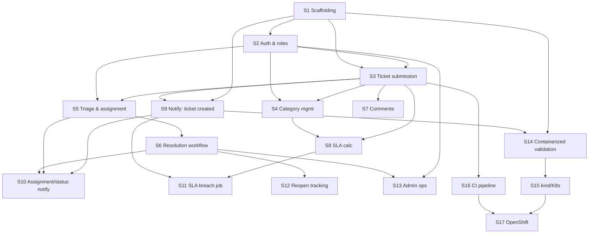

# Implementation Plan

## Status and scope

This document sequences the MVP described in `tech-brief.md` and `docs/architecture.md`
into vertical slices — each one an end-to-end piece of observable functionality,
not a technical task list. Slices are ordered by genuine dependency, not by
layer (backend-first, then frontend, etc.).

Several items in `tech-brief.md` §8 and `docs/architecture.md` "Unresolved
decisions" (auth mechanism, SLA precedence, notification reliability, event
idempotency, REST contract details, scheduled-job scaling) are not resolved
here. Each affected slice calls this out as a risk/unknown; resolving them is
in-scope for the slice that first needs the decision, not before.

Explicitly out of scope for this plan (per tech-brief §7, "Future
Enhancements"): file attachments, notification preferences, a message broker,
and a reporting/analytics dashboard. These are not planned as slices.

## Slices

### S1 — Project scaffolding & local dev stack
- **Objective:** Establish two independently buildable Spring Boot services and an Angular shell, wired together by a local Docker Compose stack with PostgreSQL, so every later slice has somewhere to land.
- **Dependencies:** None.
- **Scope:** `ticketing-service` and `notification-service` Maven projects (with `mvnw`), Angular SPA shell, `ticketing`/`notification` Postgres schemas, `docker-compose.yml` running all of it locally, empty health-check endpoints on each service.
- **Acceptance criteria:** `docker-compose up` starts Postgres, both services, and the SPA; each service responds to a health check; the SPA loads a blank page; nothing is deployed to real functionality yet.
- **Risks/unknowns:** Migration tooling for schema versioning is not selected in the brief (architecture doc, "Persistence architecture") and must be chosen here since every later schema change depends on it.

### S2 — Authentication & role identity
- **Objective:** Let a caller authenticate and be recognized as `REQUESTER`, `AGENT`, or `ADMIN`, since almost every later slice needs to know who is acting.
- **Dependencies:** S1.
- **Scope:** User entity/storage, login flow, session/token issuance, role-based authorization enforced in `ticketing-service` (never trusted from the frontend, per architecture constraints).
- **Acceptance criteria:** A seeded user of each role can log in; an authenticated request carries a verifiable identity and role; an unauthenticated request to a protected endpoint is rejected.
- **Risks/unknowns:** Authentication mechanism and identity lifecycle are explicitly undecided (architecture doc, unresolved decision #3) and must be picked here; deferring this further would force rework of every endpoint added afterward.

### S3 — Ticket submission
- **Objective:** A requester can submit a ticket and see it recorded — the first slice that produces real domain value.
- **Dependencies:** S1, S2.
- **Scope:** `Ticket` and `Category` persistence (categories seeded, not yet admin-managed), ticket-creation REST endpoint, minimal routed SPA flow (`/login` and `/tickets`) for submitting a ticket and viewing the requester's own submitted tickets.
- **Acceptance criteria:** A logged-in requester creates a ticket with title/description/category/priority; it is persisted with status `NEW`; the requester can retrieve/view it; a requester cannot view another requester's tickets; the SPA provides navigable login and ticket pages with a root redirect while backend authorization remains authoritative.
- **Risks/unknowns:** `slaDueAt` and `TicketStatusHistory` are intentionally absent from the S3 schema/write path. S8 and S6 must introduce them through new forward-only Flyway migrations (without editing the S3 migration), and the frontend must not assume those fields exist until those slices land.

### S4 — Category management (admin)
- **Objective:** An admin can manage the categories used by ticket submission, replacing the fixed seed data from S3.
- **Scope:** CRUD endpoints and a minimal admin UI for `Category` (name, description, `defaultSlaHours`).
- **Dependencies:** S2, S3.
- **Acceptance criteria:** An admin creates/edits/deactivates a category; new tickets can select it; a non-admin cannot manage categories.
- **Risks/unknowns:** Whether categories can be deleted while referenced by existing tickets needs a decision (soft-delete vs. hard restriction).

### S5 — Agent triage: queue, acknowledgement, assignment
- **Objective:** An agent can see incoming tickets and take ownership of one, moving it from `NEW` to `OPEN` and assigning themselves or another agent.
- **Dependencies:** S2, S3.
- **Scope:** Agent-facing ticket queue endpoint/UI (filter/sort by status, priority, category), assignment endpoint, `NEW → OPEN` transition, first `TicketStatusHistory` row.
- **Acceptance criteria:** An agent views unassigned tickets, assigns one to themselves, and its status becomes `OPEN`; the transition is recorded in history; a requester cannot assign tickets.
- **Risks/unknowns:** None beyond the general REST contract details still to be finalized (architecture doc, unresolved decision #7).

### S6 — Ticket resolution workflow
- **Objective:** An agent can progress a ticket through the remaining lifecycle states to resolution and closure, with every transition enforced and audited.
- **Dependencies:** S5.
- **Scope:** Add the status-history schema through a new forward-only Flyway migration, then implement `OPEN → IN_PROGRESS → ON_HOLD ⇄ IN_PROGRESS → RESOLVED → CLOSED` transitions, rejection of invalid transitions, `RESOLVED → OPEN` (requester rejects resolution), `TicketStatusHistory` row per transition, and `firstResolvedAt` set once on first `RESOLVED`.
- **Acceptance criteria:** Each documented transition succeeds and is recorded; an undocumented transition (e.g., `NEW → CLOSED`) is rejected; `firstResolvedAt` does not change on a second resolution after a reopen.
- **Risks/unknowns:** None new — this is the core state-machine slice the brief already specifies precisely.

### S7 — Ticket comments
- **Objective:** Requesters and agents can communicate on a ticket, with agent-only internal notes hidden from requesters.
- **Dependencies:** S3.
- **Scope:** `Comment` persistence, add/list endpoints, `isInternal` visibility filtering enforced server-side, SPA comment thread on the ticket detail view.
- **Acceptance criteria:** An agent posts an internal comment a requester cannot see; a requester posts a comment an agent can see; comments display in chronological order.
- **Risks/unknowns:** None significant; this slice is largely independent of the workflow slices and could be reordered after S5/S6 if preferred, but has no hard dependency on them.

### S8 — SLA calculation & display
- **Objective:** Every ticket shows a real due date so SLA adherence becomes visible and measurable.
- **Dependencies:** S3, S4.
- **Scope:** Add the SLA field(s) through a new forward-only Flyway migration, compute `slaDueAt` at ticket creation from priority and/or category, and surface it on ticket detail/list views.
- **Acceptance criteria:** A newly created ticket has a computed `slaDueAt` consistent with the documented priority windows (or category override, per the decision made here); the value is visible in the SPA.
- **Risks/unknowns:** Precedence between `Category.defaultSlaHours` and the priority table is explicitly unresolved (architecture doc, unresolved decision #4) and must be decided as part of this slice.

### S9 — Notification service: ticket-created emails
- **Objective:** A requester receives an email confirming their ticket was submitted — the first slice that exercises the two-service architecture end to end.
- **Dependencies:** S1, S3.
- **Scope:** `notification-service` REST endpoint accepting `TICKET_CREATED` events, Mailtrap SMTP integration, `NotificationLog` persistence, synchronous call from `ticketing-service` on ticket creation.
- **Acceptance criteria:** Creating a ticket results in an email visible in Mailtrap and a corresponding `SENT` (or `FAILED`, with error) `NotificationLog` row; `ticketing-service` ticket creation still succeeds even if the notification call fails.
- **Risks/unknowns:** Notification delivery reliability on failure (retry vs. drop vs. surfaced error) is explicitly unresolved (architecture doc, unresolved decision #1) and must be decided here since it is this slice's core behavior. Event idempotency (#6) should also be addressed if any retry is introduced.

### S10 — Assignment & status-change notifications
- **Objective:** Requesters and agents are emailed when a ticket is assigned or changes status, extending the event contract already proven by S9.
- **Dependencies:** S9, S5, S6.
- **Scope:** `TICKET_ASSIGNED` and `TICKET_STATUS_CHANGED` events wired from the relevant `ticketing-service` transitions to the existing notification pipeline.
- **Acceptance criteria:** Assigning a ticket emails the new assignee; each status transition emails the requester (and assignee where applicable); `NotificationLog` records each attempt.
- **Risks/unknowns:** Volume of emails per transition (e.g., whether every `ON_HOLD ⇄ IN_PROGRESS` flip should notify) is a product decision not yet made in the brief.

### S11 — SLA breach warning job
- **Objective:** Agents are proactively warned before a ticket breaches its SLA, rather than discovering it after the fact.
- **Dependencies:** S8, S9.
- **Scope:** Scheduled poll in `ticketing-service` over open tickets' `slaDueAt`, `SLA_BREACH_WARNING` event emission, corresponding notification email.
- **Acceptance criteria:** A ticket approaching its SLA deadline triggers exactly one warning email/log entry; already-resolved/closed tickets are excluded from polling.
- **Risks/unknowns:** Single-replica scaling assumption for the scheduled job is explicitly unresolved (architecture doc, unresolved decision #5) — this slice must either constrain deployment to one replica or add a locking/leader-election mechanism.

### S12 — Reopen tracking & SLA-gaming signal
- **Objective:** Make it possible to see when a ticket marked resolved/closed within SLA was reopened — the reporting signal called out as a genuine (non-deferred) target in the brief.
- **Dependencies:** S6.
- **Scope:** `Ticket.reopenCount` incremented transactionally with each `RESOLVED`/`CLOSED → OPEN` history write; a query/endpoint exposing tickets resolved within SLA but later reopened.
- **Acceptance criteria:** Reopening a resolved ticket increments `reopenCount` in the same transaction as its history row; the "resolved-within-SLA-but-reopened" query returns correct results against a seeded dataset.
- **Risks/unknowns:** This produces a queryable signal, not a UI dashboard — a full reporting view remains out of scope per tech-brief §7.

### S13 — Administrative operations
- **Objective:** An admin can perform the rare operations reserved to their role: reopening a closed ticket and managing user accounts/roles.
- **Dependencies:** S2, S6.
- **Scope:** `CLOSED → OPEN` admin-only transition, user CRUD/role-assignment endpoints and minimal admin UI.
- **Acceptance criteria:** An admin reopens a closed ticket (recorded in history, `reopenCount` incremented per S12 if merged by then); an admin creates a user and assigns a role; a non-admin cannot perform either action.
- **Risks/unknowns:** User self-registration vs. admin-only provisioning is not decided in the brief and affects this slice's scope.

### S14 — Containerized full-stack validation
- **Objective:** Prove both services and the frontend run correctly as independently built Docker images talking to each other, not just via `docker-compose` bind-mounted source.
- **Dependencies:** S1, S9 (needs both services meaningfully exercising their REST contract).
- **Scope:** Per-service Dockerfiles, image build, Compose stack running from built images, local end-to-end smoke test (create ticket → see notification log).
- **Acceptance criteria:** `docker-compose up` using built images (no source mounts) reproduces the S9 acceptance flow; each service starts with configuration supplied only via environment/compose config, not baked into the image.
- **Risks/unknowns:** None significant; this is largely packaging validation of already-built functionality.

### S15 — Kubernetes manifests & `kind` validation
- **Objective:** Run the same system on local Kubernetes, proving service discovery, config, and secrets work outside Compose.
- **Dependencies:** S14.
- **Scope:** Deployment/Service/ConfigMap/Secret manifests for both services and Postgres, validated by deploying to `kind`.
- **Acceptance criteria:** The S9 smoke-test flow succeeds against the `kind` cluster using only committed manifests (no manual `kubectl` edits after apply).
- **Risks/unknowns:** SLA-poll single-replica constraint (S11) must be encoded here (e.g., `replicas: 1` or a documented leader-election need) if not already resolved.

### S16 — CI pipeline
- **Objective:** Automate build, dependency scanning, and code-quality analysis so every change is checked consistently.
- **Dependencies:** S3 (first slice with meaningful tests to run in CI).
- **Scope:** GitHub Actions workflow: build & test → OWASP Dependency-Check → SonarQube Cloud scan, for both services.
- **Acceptance criteria:** A pull request triggers the pipeline; a failing test or a scan finding blocks merge; a clean change passes all stages.
- **Risks/unknowns:** None significant; tooling and thresholds are already specified in the brief.

### S17 — Image publishing & OpenShift deployment
- **Objective:** Deploy the validated system to the OpenShift Developer Sandbox from committed configuration only.
- **Dependencies:** S15, S16.
- **Scope:** Extend CI to build/push images to `ghcr.io`; adapt/extend the `kind` manifests for OpenShift; deploy and verify.
- **Acceptance criteria:** A merge to the main branch results in published images; applying the committed OpenShift configuration reproduces the S9 smoke-test flow in the Sandbox.
- **Risks/unknowns:** Sandbox's 30-day renewable window means this slice's deployment may need to be repeated/re-verified periodically; not a one-time acceptance check.

## Dependency overview

## Recommended first slice: S1 — Project scaffolding & local dev stack

Every other slice needs working service skeletons, a database, and a local
stack to run against — there is no vertical slice possible before this
exists. It is also the one place where "foundational work first" is
justified per the engineering principles: it isn't speculative
infrastructure, it's the minimum needed for `docker-compose up` to produce
anything, and every later slice (including the very next one, authentication)
depends on it directly.
