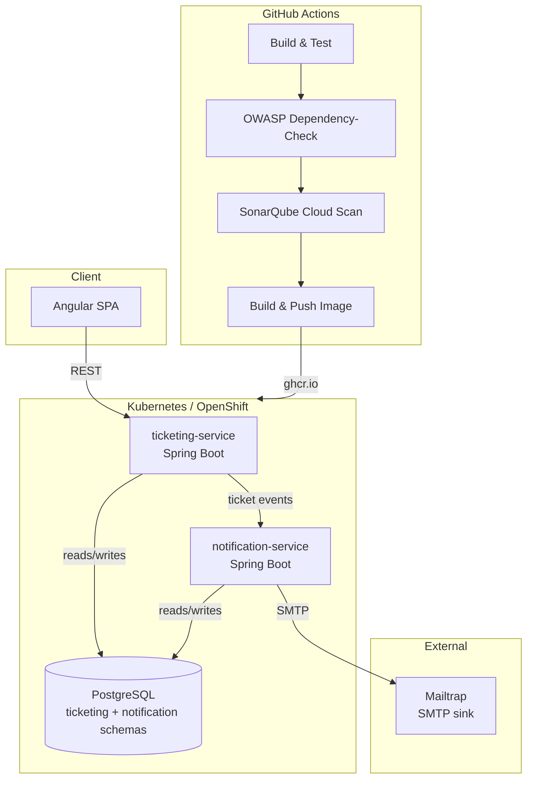
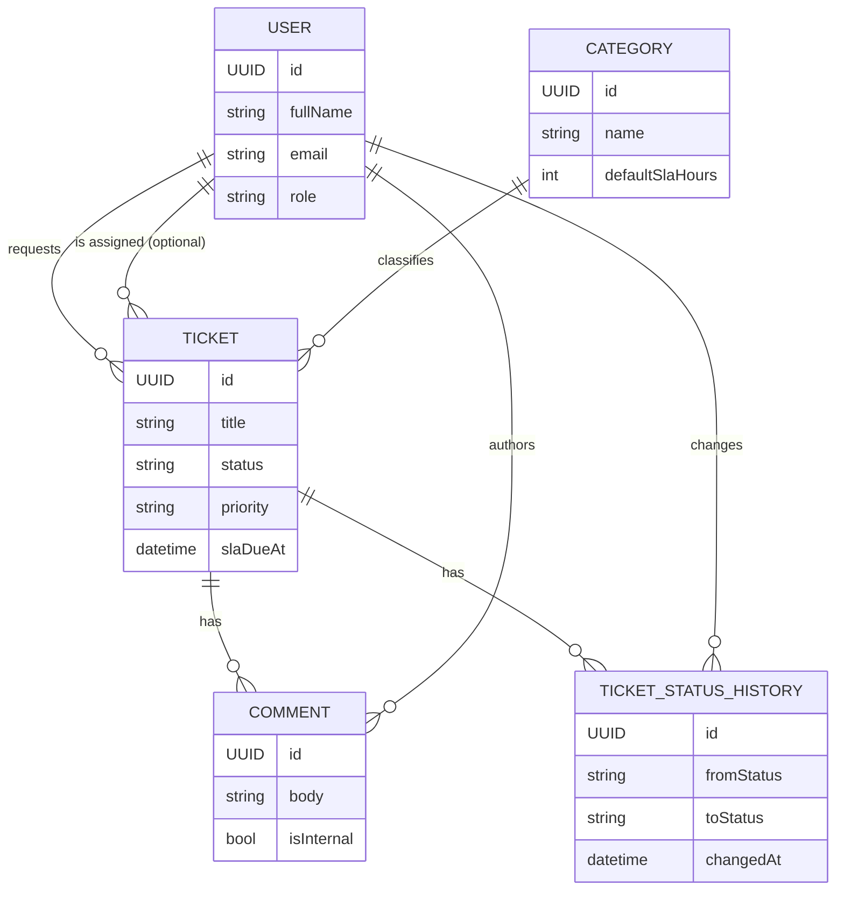
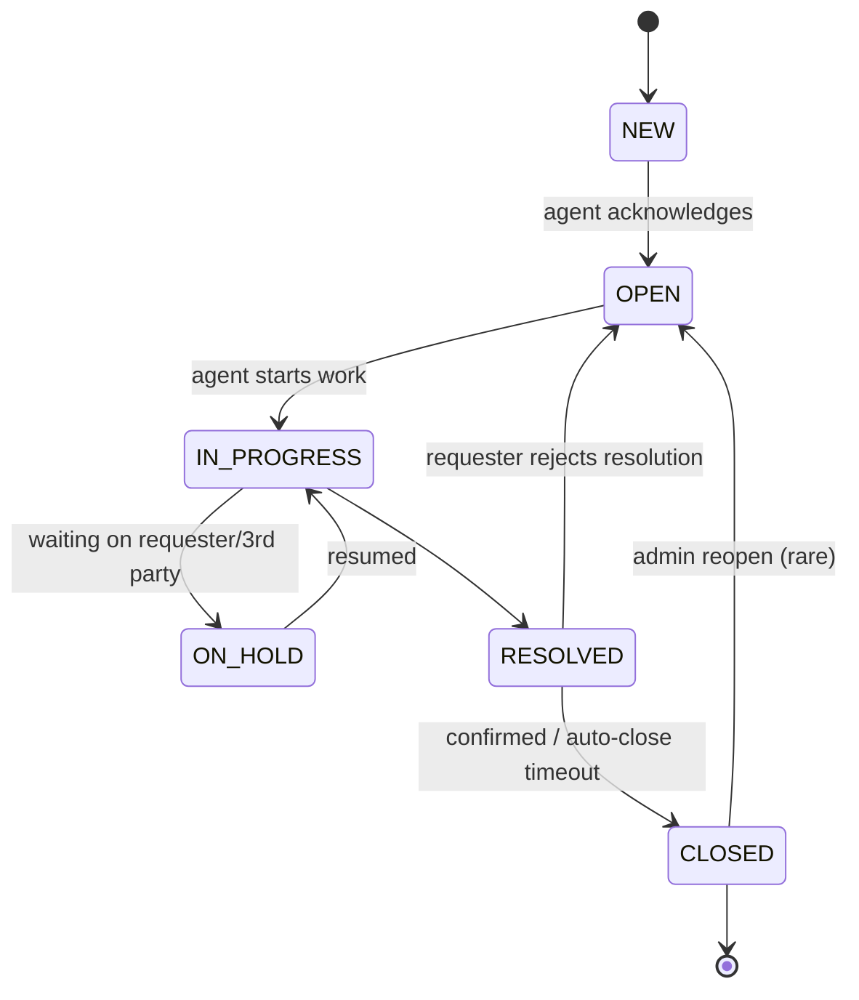

# Tech Brief — IT Service Desk Platform

> Living source-of-truth document. Update this as decisions change — especially the domain model, which is not yet finalized.

## 1. Purpose

An internal IT service desk / ticketing system, modeled on real tools like Jira Service Management or Zendesk, scoped down to a learning-appropriate size. Employees submit tickets, agents triage and resolve them, and the system tracks status history and SLA timing. Built as two cooperating Spring Boot services rather than a monolith specifically so that container orchestration (Kubernetes/OpenShift) has a genuine job to do — service discovery, independent scaling, and inter-service config/secrets — rather than being decorative.

## 2. Tech Stack

| Layer | Choice | Notes |
|---|---|---|
| Backend language/runtime | Java 21 (Eclipse Temurin) | Oracle JDK avoided for this project due to its licensing/update terms; Temurin is fully open-source |
| Backend framework | Spring Boot 3.x | Two independent services (see §3) |
| Build tool | Maven (via `mvnw` wrapper) | Wrapper committed to repo so build tooling is version-locked across machines |
| Frontend | Angular (latest LTS) | Separate SPA, calls `ticketing-service` REST API |
| Database | PostgreSQL | Single instance, one schema per service (`ticketing`, `notification`) to preserve service ownership boundaries |
| Dev email sink | Mailtrap (free tier) | Fake SMTP target for `notification-service` |
| Dependency scanning | OWASP Dependency-Check (Maven plugin) | Run per-service against `pom.xml` |
| SAST | SonarQube Cloud | Connected Mode to "SonarQube for IDE" plugin in IntelliJ for live local feedback matching CI rules |
| CI/CD | GitHub Actions | Build → OWASP scan → Sonar scan → image build/push |
| Container images | Docker (Docker Desktop locally) | Built per-service |
| Image registry | GitHub Container Registry (ghcr.io) | Tied to existing GitHub account, no separate signup |
| Local orchestration | `kind` (Kubernetes-in-Docker) | Fast iteration on manifests before pushing to OpenShift |
| Cloud orchestration target | OpenShift Developer Sandbox | Free 30-day renewable window; everything deployed here must be reproducible from committed YAML/Helm, not console clicks |
| IDE | IntelliJ IDEA Community + SonarQube for IDE plugin | |
| DB client | pgAdmin 4 | |
| API client | Postman | |

## 3. Service Breakdown

### 3.1 `ticketing-service`
Core domain service. Owns:
- Tickets (title, description, priority, status, SLA clock)
- Categories
- Comments / status history
- Assignment (agent ↔ ticket)

Exposes REST API consumed by the Angular frontend. Emits ticket lifecycle events (created, assigned, SLA-warning, resolved) consumed by `notification-service`.

### 3.2 `notification-service`
Listens for ticket events and sends email notifications via Mailtrap. Deliberately decoupled from `ticketing-service`'s database — has no direct DB access to ticketing data, only reacts to events/API calls, to keep the service boundary honest.

### 3.3 `frontend` (Angular SPA)
Presentation layer only. No direct DB or business logic — all state changes go through `ticketing-service`'s API.

## 4. Layer Breakdown

| Layer | Components |
|---|---|
| Presentation | Angular SPA |
| API / Application | `ticketing-service`, `notification-service` (Spring Boot REST) |
| Data | PostgreSQL (`ticketing` schema, `notification` schema) |
| External integration | Mailtrap (email) |
| CI/CD | GitHub Actions: build → OWASP Dependency-Check → SonarQube Cloud scan → Docker build → push to ghcr.io |
| Orchestration | `kind` (local dev/test) → OpenShift Developer Sandbox (deployed target), via committed Kubernetes/Helm manifests |

## 5. Architecture Diagram

## 6. Domain Model

### 6.1 Entities

**`ticketing-service` schema**

| Entity | Key Fields |
|---|---|
| `User` | id, fullName, email (unique), role (`REQUESTER` / `AGENT` / `ADMIN`), createdAt |
| `Category` | id, name, description, defaultSlaHours |
| `Ticket` | id, title, description, status, priority, category (FK), requester (FK User), assignee (FK User, nullable), createdAt, updatedAt, slaDueAt, resolvedAt (nullable), closedAt (nullable), **reopenCount** (int, default 0), **firstResolvedAt** (nullable, set once, immutable) |
| `Comment` | id, ticket (FK), author (FK User), body, isInternal (bool), createdAt |
| `TicketStatusHistory` | id, ticket (FK), fromStatus, toStatus, changedBy (FK User), changedAt, note (nullable) |

**`notification-service` schema**

| Entity | Key Fields |
|---|---|
| `NotificationLog` | id, eventType, ticketId (plain reference, no cross-schema FK), recipientEmail, subject, sentAt, status (`SENT`/`FAILED`), errorMessage (nullable) |

**Deferred (not in MVP):** file attachments (needs object storage), per-user notification preferences.

### 6.2 Relationships

- User (1) → Ticket (*) as **requester**
- User (0..1) → Ticket (*) as **assignee**
- Category (1) → Ticket (*)
- Ticket (1) → Comment (*)
- Ticket (1) → TicketStatusHistory (*)
- User (1) → Comment (*) as **author**
- User (1) → TicketStatusHistory (*) as **changedBy**

### 6.3 Ticket State Machine

**SLA-by-priority defaults:**

| Priority | SLA window |
|---|---|
| CRITICAL | 4 hours |
| HIGH | 8 hours |
| MEDIUM | 24 hours |
| LOW | 72 hours |

**Reopen tracking & SLA-gaming detection.** `TicketStatusHistory` is the source of truth for every transition, including reopens (any `RESOLVED`/`CLOSED → OPEN` row). To keep reporting queries fast without joining the history table every time, `Ticket.reopenCount` is incremented transactionally alongside each such history write. `Ticket.firstResolvedAt` is set once, on the *first* transition into `RESOLVED`, and never overwritten — comparing it against `slaDueAt` shows whether the original resolution attempt genuinely met SLA, independent of later reopens. This makes it possible to build a report for "tickets resolved within SLA but reopened at least once" — a real red flag for agents closing tickets prematurely to protect SLA metrics rather than actually fixing the issue.

### 6.4 Cross-Service Event Contract

`ticketing-service` calls `notification-service` synchronously over REST on each event (no message broker in the current tool list — flagged as a future enhancement, see §7).

| Event | Trigger |
|---|---|
| `TICKET_CREATED` | New ticket submitted |
| `TICKET_ASSIGNED` | Assignee set/changed |
| `TICKET_STATUS_CHANGED` | Any status transition |
| `SLA_BREACH_WARNING` | Scheduled job in `ticketing-service` polling `slaDueAt` |

Payload: `eventType, ticketId, title, requesterEmail, assigneeEmail, oldStatus, newStatus, priority, slaDueAt, timestamp`

## 7. Future Enhancements (Phase 2+)

Ideas deliberately kept out of MVP scope, banked here for later:

- **File attachments** — needs object storage (self-hosted MinIO for a free/local-first option, or a cloud provider bucket if we move off the free tiers). Would attach to both `Ticket` and `Comment`.
- **Notification preferences** — let users opt in/out of specific event types per-channel.
- **Message broker between `ticketing-service` and `notification-service`** — currently flagged as a live design discussion (see §8), not just a nice-to-have. Candidate options to evaluate:
  - **RabbitMQ** — lightweight, easy to self-host via Docker/K8s, gentle learning curve, well-suited to this project's scale.
  - **ActiveMQ Artemis** — JMS-native, common in traditional enterprise Java shops; pairs naturally with Spring's JMS support.
  - **Apache Kafka** — event-streaming rather than simple queueing; more relevant if this project ever pretends to be higher-scale or wants replay/audit-log semantics, but heavier to operate and arguably overkill at this project's size.
  - **Redis Streams** — lightest-weight option if Redis is already in the stack for caching; less mature ecosystem for this use case than the above three.
  - **Cloud-native / platform-native option** — if deployed on OpenShift specifically, Red Hat's AMQ Broker Operator or the Strimzi Kafka Operator are worth a look since they'd double as extra OpenShift-operator learning; if the project ever moved to a public cloud, that host's managed queue (SQS/Service Bus/etc.) would be the equivalent choice.
- **Reporting/analytics view** — a lightweight dashboard (even just a Grafana instance pointed at Postgres) for the SLA-gaming-style reports described in §6.3, rather than ad-hoc SQL.

## 8. Open Design Discussions

- **Service-to-service communication model.** Currently spec'd as synchronous REST (§6.4). Worth digging into further given the reliability concern it raises: what should happen to a `TICKET_CREATED` notification if `notification-service` is unreachable when `ticketing-service` calls it — silently drop it, retry with backoff, or introduce a broker so `ticketing-service` never blocks on notification delivery at all? This directly informs whether the message broker item above should be pulled forward from "Phase 2" into the initial build.

## 9. Open Items / Next Steps

- [x] Finalize domain model (entities, relationships, ticket state machine)
- [ ] Decide sync-vs-async service communication model (§8) before scaffolding the event contract
- [ ] Scaffold `ticketing-service` and `notification-service` Maven projects
- [ ] Define REST contracts between frontend ↔ `ticketing-service` and `ticketing-service` ↔ `notification-service`
- [ ] Write initial `docker-compose.yml` for full local stack
- [ ] Write initial Kubernetes manifests (Deployment/Service/ConfigMap/Secret) for `kind`
